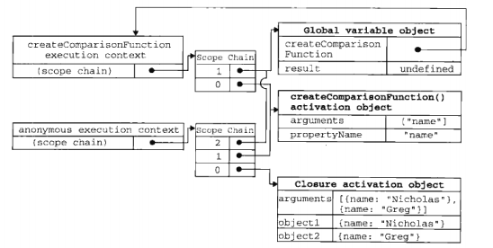
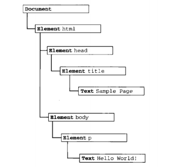
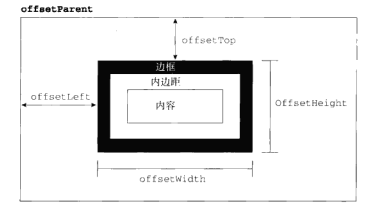
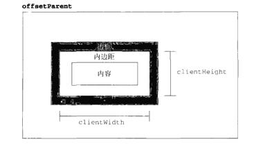
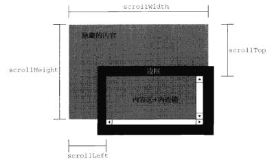

# Javascript高级程序设计(第三版)读书笔记
- [第1章 Javascript简介](https://github.com/xblcity/reading-notes/blob/master/books/professional-javascript.md#第1章-Javascript简介)
- [第2章 在HTML中使用javascript](https://github.com/xblcity/reading-notes/blob/master/books/professional-javascript.md#第2章-在HTML中使用javascript)
- [第3章 基本概念](https://github.com/xblcity/reading-notes/blob/master/books/professional-javascript.md#第3章-基本概念)
- [第4章 变量、作用域和内存问题](https://github.com/xblcity/reading-notes/blob/master/books/professional-javascript.md#第4章-变量、作用域和内存问题)
- [第5章 引用类型](https://github.com/xblcity/reading-notes/blob/master/books/professional-javascript.md#第5章-引用类型)
- [第6章 面向对象的程序设计](https://github.com/xblcity/reading-notes/blob/master/books/professional-javascript.md#第6章-面向对象的程序设计)
- [第7章 函数表达式](https://github.com/xblcity/reading-notes/blob/master/books/professional-javascript.md#第7章-函数表达式)
- [第8章 BOM](https://github.com/xblcity/reading-notes/blob/master/books/professional-javascript.md#第8章-BOM)
- [第9章 客户端检测](https://github.com/xblcity/reading-notes/blob/master/books/professional-javascript.md#第9章-客户端检测)
- [第10章 DOM](https://github.com/xblcity/reading-notes/blob/master/books/professional-javascript.md#第10章-DOM)
- [第11章 DOM扩展](https://github.com/xblcity/reading-notes/blob/master/books/professional-javascript.md#第11章-DOM扩展)
- [第12章 DOM2和DOM3](https://github.com/xblcity/reading-notes/blob/master/books/professional-javascript.md#第12章-DOM2和DOM3)
- [第13章 事件](https://github.com/xblcity/reading-notes/blob/master/books/professional-javascript.md#第13章-事件)
- [第14章 表单脚本](https://github.com/xblcity/reading-notes/blob/master/books/professional-javascript.md#第14章-表单脚本)

:sunny; :sparkles;

## 第1章 Javascript简介
- 最初是为了处理客户端简单验证
- JS实现包含 ECMAScript, DOM, BOM

## 第2章 在HTML中使用javascript
- `<script>`标签
- 使用defer,async异步加载脚本
- 使用`script`实现jsonp

## 第3章 基本概念
### 3.1 语法
#### 3.1.1 区分大小写

#### 3.1.2 标识符
- 就是指变量，函数，属性的名字，或者函数的参数
- 标识符第一个必须是字母，下划线_或美元符号 $

#### 3.1.3 注释
- 单行与多行注释

#### 3.1.4 严格模式
- `"use strict";`

#### 3.1.5 语句
- 行尾加不加分号
- 代码块

### 3.2 关键字和保留字

### 3.3 变量
- 弱类型

### 3.4 数据类型
- 6种简单数据类型，number, string, boolean, null, undefined, symbol
- object类型

#### 3.4.1 typeof操作符
#### 3.4.2 Undefined类型
#### 3.4.3 Null类型
#### 3.4.4 Boolean类型
- if语句自动执行 Boolean()

#### 3.4.5 Number类型
#### 3.4.6 String类型
#### 3.4.7 object类型

### 3.5 操作符
#### 3.5.1 一元操作符
只能操作一个值的操作符叫一元操作符  
递增递减操作符
`--num1 num1-- ++num1 num1++`  
一元加和减操作符
`+num1 -num1`
#### 3.5.2 位操作符
涉及到二进制
#### 3.5.3 布尔操作符
逻辑非！  
逻辑与&&  
逻辑或 ||
#### 3.5.4 乘性操作符
乘法*
除法 、
求模(取余) %
#### 3.5.5 加性操作符
加法  
如果有一个操作数是对象，数值或布尔值，则调佣它们的toString方法，对于Undefined和Null则调用String()方法  
减法
#### 3.5.6 关系操作符
#### 3.5.7 相等操作符
#### 3.5.8 条件操作符
#### 3.5.9 赋值操作符
#### 3.5.10 逗号操作符

### 3.6 语句
#### 3.6.1 if语句
#### 3.6.2 do-while语句
#### 3.6.3 while语句
#### 3.6.4 for语句
#### 3.6.5 for-in语句
#### 3.6.6 label语句
#### 3.6.7 break和continue语句
#### 3.6.8 with语句
#### 3.6.9 switch语句

### 3.7 函数
#### 3.7.1 理解参数
#### 3.7.2 没有重载

### 3.8 小结


## 第4章 变量、作用域和内存问题

### 4.1 基本类型和引用类型的值

#### 4.1.1 动态的属性
- 引用类型的属性是动态的，可以重设

#### 4.1.2 复制变量值
- 复制变量值，复制基本类型值，会创建新值，复制引用类型的值，值的副本是指针

#### 4.1.3 传递参数
- 函数参数是按值传递的，参数是函数内部的局部变量
```js
function setName(obj) {
  obj.name = 'nicocity'
  obj = new Object()
  obj.name = 'Grey'
}
var person = new Object()
setName(person)
console.log(person.name) // 'nicocity'
```
#### 4.1.4 检测类型
- typeof操作符用于检测基础类型(null除外)，object以及function，如`typeof 'a'`,输出string  
- instance操作符检测引用类型, 如`[1,2] instanceof Array`, 输出true  

### 4.2 执行环境及作用域
- 执行环境(execution context)，也称环境  
- web浏览器全局执行环境是window  
- 代码在一个环境中执行时，会创建对象变量的一个作用域链

#### 4.2.1 延长作用域链
- with, try...catch, 块作用域

#### 4.2.2 没有块作用域(X)

### 4.3 垃圾收集

#### 4.3.1 标记清除
- 垃圾收集器在运行时会给内存中所有变量加上标记，然后去掉环境中的变量以及被环境中变量引用的变量的标记(闭包？)，而在此之后再被加上标记的变量被视为准备删除的变量，因为环境中的变量已经无法访问到这些变量了，最后，垃圾搜集器完成内存清除工作，销毁哪些带标记的值并回收它们所占用的内存空间。

#### 4.3.2 引用计数
- 会出现循环引用问题

#### 4.3.3 性能问题

#### 4.3.4 管理内存
- 手动将数据的值设为null，解除引用

### 4.4 小结

## 第5章 引用类型

### 5.1 Object类型
- new Object() 或者 对象字面量 创建对象实例
- 使用. 或者 [] 访问对象属性

### 5.2 Array类型
- 创建方式： new Array(), 字面量， [...Array(20)]  
- length属性

#### 5.2.1 检测数组
- `anArray instanceof Array, Array.isArray(someArray)`

#### 5.2.2 转换方法
- 所有对象都具备的 toString() toLocaleString() valueOf()
- join, 逆向 String.split()

#### 5.2.3 栈方法
- LIFO, Last-In-First-Out  
- pop() push() 不传参则默认取最后一项，会改变原数组

#### 5.2.4 队列方法
- FIFO First-In-First-Out
- shift() unshift() 不传参默认取第一项，会改变原数组

#### 5.2.5 重排序方法
reverse() 和 sort() 后者可以传入自定义回调函数  
sort()传入回调函数return 正值 则说明第一个参数应该位于第二个参数之前，即交换顺序，负数则相反，0则不变
```js
[1,20,5,2].sort(function compare(prev, cur) {
  if (prev < cur) {
    return 1
  } else if (prev > cur) {
    return -1
  } else {
    return 0
  }
}) // 输出 [20, 5, 2, 1]
```

#### 5.2.6 操作方法
- concat() aArray.concat(bArray)
- slice(begin) 或者 slice(begin, end)
- splice() 功能强大但是会改变原数组 splice(beigin, 截取长度, 替换)

#### 5.2.7 位置方法
- indexOf() lastIndexOf() 参数是要查找的项
- es6可以使用 find或者 findIndex迭代方法

#### 5.2.8 迭代方法
- forEach, every, some, filter, map 都可以传递三个参数
- es6 find, findIndex, includes

#### 5.2.9 归并方法
reduce, reduceRight

**ES6新增**: Array.from(),Array.of(),copeWithin(),find,findIndex,fill,includes(ES7)

### 5.3 Date类型
- new Date() 输出时间格式的字符串
- new Date(2131231) 传入毫秒数，也会输出时间格式字符串  
**构造器上面的方法，即Date函数/constructor，或者可以说是prototype的constructor属性上面的方法**  
- Date.parse(new Date()) 传入时间格式字符串，返回毫秒数
- Date.now() 返回毫秒数  
**原型上面的方法，即Date实例的原型(prototype)上面的方法**   
- 例如, new Date().getTime()

#### 5.3.1 继承的方法
来自Object原型链的方法  
toLocaleString()会根据地区的时间格式返回相应时间

#### 5.3.2 日期格式化方法
- toDateString, toTimeString, toLocaleDateString, toLocaleTimeString, toUTCString
- toLocaleTimeString,toLocaleDateString和toLocaleString之间的区别

#### 5.3.3 日期/时间组件方法
Date类型  
getTime// 返回毫秒数, getFullYear, getMounth, getDay, getHours...

### 5.4 RegExp类型
- `const expression = /pattern/ flags` flags包含 g,i,m  
- 元字符必须要转义，如`. [ { ^ $ ? * | \` 需要在前面加上 `\`  
- `const pattern = /[bc]at/i` 匹配第一个bat或者cat，不区分大小写  
- test()

#### 5.4.1 RegExp实例属性

#### 5.4.2 RegExp实例方法
- exec('要检测的字符串') // 返回数组，查找不到返回null
- test('要检测的字符串') // 返回布尔值

#### 5.4.3 RegExp构造函数属性

#### 5.4.4 模式的局限性

### 5.5 Function类型

#### 5.5.1 没有重载
- 后面的函数会覆盖前面的函数，ts有函数重载

#### 5.5.2 函数声明与函数表达式
- 函数声明比函数表达式先被读取，即函数提升

#### 5.5.3 作为值的函数
- 访问函数而不执行函数，需要去掉函数名后面的括号
- 函数可以作为参数
- 函数内部返回函数
```js
function createComparisonFunction(propertyName) {
  return function(object1, object2) {
    var value1 = object1[propertyName]
    var value2 = object2[propertyName]
    if (value1 < value2) {
      return -1
    } else if (value1 > value2) {
      return 1
    } else {
      return 0
    }
  }
}
var data = [{name: 'li', age: 28}, {name: 'nico', age: 21}]
data.sort(createComparisonFunction('name')) // 依据name进行排序
```

#### 5.5.4 函数内部属性
- arguments
- callee
- this

#### 5.5.5 函数属性和方法
构造函数属性  
- length 是函数希望接收到的参数个数
- prototype
原型上方法
- apply/call/bind 改变函数执行作用域/上下文环境/this


### 5.6 基本包装类型
特殊的引用类型  
- Boolean
- Number
- String  
当上述基本值被读取的时候，后台会创建对应的基本包装类型的对象，从而我们可以调用方法来操作这些数据
```js
var s1 = 'some text'
var s2 = s1.substring(2)

// 基本类型值不是对象，不该有方法，当访问s1时，实际执行了下面操作
// 1.创建实例2.在实例上面调用方法3.销毁这个实例
var s1 = new String('some text')
var s2 = s1.substring(2)
s1 = null
```

#### 5.6.1 Boolean类型

#### 5.6.2 Number类型
- toFixed()

#### 5.6.3 String类型
- 属性 length
- concat 大部分还是使用 `+`号
- slice, substring, substr,对原始字符无影响
- slice,substring第一个参数是起始位置，第二个是结束位置，substr第二个参数是返回字符个数
- indexOf，lastIndexOf, `'myname'.indexOf(n)`结果为3，找不到返回-1
- trim,删除前后位置所有空格，`'  sc  '.trim()` 结果 'sc'
- toLowerCase, toUpperCase，大小写转换
- match，与RegExp的exec相同，match只接收正则表达式，`'cat, fat'.match(/.at/)`,返回数组...
- search同match，返回索引或-1
- replace,两个参数，用于替换字符串，`'cat, bat'.replace(/at/g, 'ond')` 返回 `'cond, bond'`
- split，传入要根据分割的符号，不传的分割单个字母，如`'me'.split()` 返回 `'m','e'`
- localeCompare,比较字符串

### 5.7 单体内置对象
#### 5.7.1 Global对象
- encodeURI, encodeURICompoent,后者会对任何非标准字符进行编码，用的更多
- decodeURI, decodeURIComponent,后者可以解码任何特殊字符编码
- eval，传入字符串，但会被当做js语句执行，容易被脚本注入，非常危险
##### Golbal属性
- 特殊值：undefined,NaN,Infinity,构造函数：Object,Array,Function,Boolean,String,Number
- 构造函数：Date, RegExp, Error, EvalError, RangeError, ReferenceError, SyntaxError, TypeError, URIError
##### ECMAScript虽然没有指出如何访问Global对象，但web浏览器都是将这个全局对象作为window对象的一部分实现的

#### 5.7.2 Math对象
##### Math对象属性
- Math.PI等
##### Math方法
- Math.min(), Math.max() 传入多个number类型值
- 找到数组中最大值，`var values = [1,2,5,7,8]; var max = Math.max.bind(Math, values)`
- 舍入方法，Math.ceil, Math.floor, Math.round
- Math.random, `Math.floor(Math.random()*10 + 1)`
- 还有其他方法，如Math.abs(num)绝对值, Math.exp(num)n次幂, Math.sqrt(num)平方根，Math.cos(x)余弦值，等等。。。

### 5.8 小结
- Object是基础类型，其他引用类型都从Object继承
- Array,Date,RegExp,Function以及三个包装类型 String,Number,Boolean,
- 内置对象Global以及Math

## 第6章 面向对象的程序设计
### 6.1 理解对象
#### 6.1.1 属性类型
##### 数据属性
- 有四个描述其行为的特性：
- Configurable,是否可通过delete删除属性重新定义，Enumerable,是否可以通过for-in循环返回属性
- Writeale,属性值是否可被修改，Value属性的数据值  
修改属性默认特性，需要使用Object.defineProperty(), 接收三个参数
##### 访问器属性
- 不包含数据值，包含一对getter,setter函数，读取访问器属性，会调用getter函数，这个函数负责返回值，写入访问器属性时，会调用setter函数并传入新值，这个函数决定如何处理数据
- configurable, enumrable, get, set
```js
var book = {
  _year: 2004,
  edition: 1
}
Object.defineProperty(book, 'year', {
  get: function() {
    return this._year
  },
  set: function(newValue) {
    if(newValue > 2004) {
      this._year = newValue
      this.edition += newValue - 2004
    }
  }
})
book.year = 2005
console.log(book.edition) // 2
console.log(book.year) // 2005
```
#### 6.1.2 定义多个属性
```js
var book = {}
Object.defineProperties(book, {
  _year: {
    writable: true,
    value: 2004
  },
  year: {
    get: function() {
      return this._year
    },
    set: function newValue() {
      if(newValue > 2004) {
        this._year = newValue
      }
    }
  }
})
```

#### 6.1.3 获取属性的特性
`Object.getOwnPropertyDescriptor(book, '_year')` 得到一个对象，包括'configurable, enumerable, get, set/ writable, value'

### 6.2 创建对象

#### 6.2.1 工厂模式
```js
function createPerson(name, age, job) {
  var o = new Object()
  o.name = name
  o.age = age
  o.job = job
  o.sayName = function() {
    alert(this.name)
  }
  return o
}
var person1 = createPerson('Nicholas', 29, 'Software Engineer')
person1.sayName()
```

#### 6.2.2 构造函数模式
```js
function Person(name, age, job) {
  this.name = name
  this.age = age
  this.job = job
  this.sayName = function() {
    alert(this.name)
  }
}
var person1 = new Person('Nicholas', 29, 'Software Engineer')
var person2 = new Person('Greg', 23, 'Doctor')
person1.sayName()
```
与工厂函数的区别，没有显式创建对象，直接将属性的方法赋给了this对象，没有return语句  
创建构造函数的实例，必须使用new操作符  
new做了一下操作，创建一个新对象，this指向新对象，新对象原型指向构造函数原型，执行代码，返回这个对象
```js
person1.constructor === Person // 原型链查找 true
person2.constructor === Person // 原型链查找 true
person1.__proto__.constructor === Person // true
person1 instanceof Person // true 原型链匹配
person1.sayName === Person2.sayName  // false
```
构造函数缺点，每个方法都要在实例上面重新创建一遍

#### 6.2.3 原型模式
```js
function Person() {

}
Person.prototype.name = 'Nicholas'
Person.prototype.age = 29
Person.prototype.job = 'Software Engineer'
Person.prototype.sayNmae = function() {
  alert(this.name)
}
var person1 = new Person()
person1.sayName() // 'Nicholas'
var person2 = new Person()
person2.sayName() // 'Nicholas'
alert(person1.sayName === Person2.sayName) // true
```
**创建一个函数，函数会自动创建一个proto属性，这个属性指向原型对象，原型对象会自动化获得一个constructor属性，constructor指向构造函数**  
从实例开始查找，找不到则向原型链上查找  
判断是不是实例上面的属性，用xxx.hasOwnProperty('xxx')
单独使用 In 操作符，用 'name' in Person 可以判断属性是否在 原型||实例 上  
可枚举实例属性，Object.keys()  
重写原型的方法  
```js
function Person() {}
Person.prototype = {
  name: 'xx',
  sayName: function() {
    console.log('sayNmae')
  }
  // 手动设置constructor: Person
}
// constructor属性不再指向Person了，等于重写了prototype
```
下面这个例子
```js
function Person() {}
var friend = new Person()
Person.prototype = {
  constructor: Person,
  name: 'nico',
  sayName: function() {
    console.log(this.name)
  }
}
var friend2 = new Person()
friend.sayName()  // typeError: friend.sayName is not a function， friend的prototype是之前的那个
friend2.sayName()  // 'nico'
// 重写原型对象切断了现有原型与任何执勤啊已经存在的对象实例之间的联系
```
构造函数缺陷：省略了构造函数传递初始化参数这一环节，结果所有实例在默认情况下都取得了相同的值  
原型中很多属性是共享的，对于函数来说比较合适，对于基本值，甚至是对象，问题比较突出，因为是同一个引用，所以改变这个对象，所有实例上面的这个属性都会改变

#### 6.2.4 组合使用构造函数模式和原型模式

#### 6.2.5 动态原型模式
```js
function Person(name, age, job) {
  // 属性
  this.name = name
  this.age = age
  this.job = job
  // 方法
  if (typeof this.sayName !== 'function') {
    Person.prototype.sayName = function() {
      console.log(this.name)
    }
  }
}
var friend = new Person('nico', 29, 'Software Engineer')
friend.sayName()
```
只有在sayName方法不存在情况下，才会将它添加到原型中，这段代码会在初次调用构造函数时执行

#### 6.2.6 寄生构造函数模式
```js
function createPerson(name, age, job) {
  var o = new Object()
  o.name = name
  o.age = age
  o.job = job
  o.sayName = function() {
    alert(this.name)
  }
  return o
}
var person1 = new createPerson('Nicholas', 29, 'Software Engineer')
person1.sayName()
```
与工厂函数相比，使用了new操作符

#### 6.2.7 稳妥构造函数模式

### 6.3 继承
#### 6.3.1 原型链
```js
Son.prototype = new Father()
```
Son构造函数的原型指向Fatcher的实例  
Son prototype 的 原型是 Father
Son构造函数的原型上没有construtor，因为原型被赋值语句改变了指针  
通过 instanceof 或者 isPrototype来判断原型链

###### 原型链实现继承
```js
function SuperType() {
  this.property = true
}
superType.prototype.getSuperValue = function() {
  return this.property
}

function SubType() {
  this.subProperty = false
}
// 继承
subType.prototype = new SuperType()

var instance = new SubType()
alert(instance.getSuperValue()) // false
```
原型链存在的问题
```js
function SuperType() {
  this.colors = ['red', 'blue', 'green']
}
function SubType() {
}

// 继承
SubType.prototype = new SuperType()

var instance1 = new SubType()
instance1.colors.push('black')
alert(instance1.colors)  // ['red', 'blue', 'green', 'black']

var instance2 = new SubType()
alert(instance2.colors)  // ['red', 'blue', 'green', 'black']
```
原型链继承缺点很明显，原型链上的属性值由所有SubType实例继承，更改其中一个实例的属性(其实就是原型链上的属性)，会影响到所有实例上的属性(其实也是原型链上的属性)

#### 6.3.2 借用构造函数
```js
function SuperType() {
  this.colors = ['red', 'blue', 'green']
}
function SubType() {
  Super.call(this) // 执行构造函数，只继承SuperType构造器上的属性(没有使用new调用，所以不存在原型继承哦)
}

var instance1 = new SubType()
instance1.colors.push('black')
alert(instance1.colors)  // ['red', 'blue', 'green', 'black']

var instance2 = new SubType()
alert(instance2.colors)  // ['red', 'blue', 'green']
```
因为SubType每次生成实例，都会先调用SuperType的构造函数，所以每个实例的color属性互相不影响

###### 传递参数
```js
function SuperType(name) {
  this.name = name
}
function SubType(name, age) {
  SuperType.call(this, name)
  this.age = age
}
var instance = new SubType('nico', 19)
alert(instance.name, instance.age) // nico 19
```
缺点也很明显，属性，方法都在构造函数中定义，那函数复用也就无从谈起了

#### 6.3.3 组合继承
又称伪经典继承，指的是将原型链和借用构造函数的技术组合到一块，从而发挥二者之长的一种继承模式
```js
function SuperType(name) {
  this.name = name
  this.colors = ['red', 'blue', 'green']
}

SuperType.prototype.sayName = function() {
  alert(this.name)
}

function SubType(name, age) {
  // 继承属性
  SuperType.call(this, name) // 仅仅继承了实例属性(因为没有用new 调用)
  this.age = age
}

// 继承方法
SubType.prototype = new SuperType() // 继承构造函数实例，包括原型上的方法和实例属性（属性没有用到，造成一次浪费）
SubType.prototype.constructor = SubType
SubType.prototype.sayAge = function() {
  alert(this.age)
}

var instance1 = new SubType('nico', 22)
instance1.colors.push('black')
alert(instance1.colors)  // ['red', 'blue', 'green']
instance1.sayName() // 'nico'
instance1.sayAge() // 22
```
避免了原型链和借用构造函数的缺陷，instanceof 和 isPropertyof() 能够用于识别基于组合继承创建的对象  
缺点，两次调用了构造函数，有一次造成了属性的浪费

#### 6.3.4 原型式继承

#### 6.3.5 寄生式继承

#### 6.3.6 寄生组合式继承
通过构造函数继承属性，通过原型链混成的形式继承方法（利用object.create方法）
```js
function inheritPrototype(subType, superType) {
  var prototype = object.create(superType.prototype) // prototype对象的原型指向了superType的原型
  prototype.constructor = subType  // 子类拥有自己的构造器
  subType.prototype = prototype  // 子类的原型指向prototype, 而prototype的原型又指向了superType的原型
}
```
```js
function SuperType(name) {
  this.name = name
  this.colors = ['red', 'blue', 'green']
}
SuperType.prototype.sayName = function() {
  alert(this.name)
}

function SubType(name, age) { 
  SuperType.call(this, name) // 只继承SuperType的实例属性，并传参
  this.age = age
}
inheritPrototype(SubType, SuperType) // 自定义原型链的指向
SubType.sayAge = function() {
  alert(this.age)
}
```

### 6.4 总结

## 第7章 函数表达式
函数声明，函数声明存在函数提升
```js
function sayName (name) {
  console.log(name)
} 
// function 是关键字， sayName是标识符
sayName.name // sayName
```
函数表达式
```js
var sayName = function (name) {
  console.log(name)
}
```
这种形式看起来像常规的变量赋值语句，即创建一个函数，并把它赋值给变量sayName  
这种情况下创建的函数叫做匿名函数(anonymous function), 因为function 关键字后面没有标识符(匿名函数有时候也叫拉达姆函数)  

**函数声明，如果重复声明，后面的声明会覆盖前面的声明**
**在把函数当成值来使用的时候，都可以使用匿名函数，但这并不是匿名函数的唯一用途**

### 7.1 递归
递归函数是在一个函数通过名字调用自身的情况下构成的
```js
function factorial(num) {  // factorial是阶乘的意思
  if (num <= 1) {
    return 1
  } else {
    return num * factorial(num - 1)
  }
}
```
这是一个经典的递归阶乘
```js
var anotherFactorial = factorial
factorial = null
alert(anotherFactorial(4)) // 出错
```
在调用anotherFactorial时，必须要执行factorial，但是factorial已经是null了，所以报错  
上述赋值赋值语句，即声明了 一个  函数表达式  

可以用arguments.callee解决函数调用自身出错的情况
```js
function factorial(num) {
  if (num <= 1) {
    return 1
  } else {
    return num * arguments.callee(num - 1)
  }
}
```

### 7.2 闭包
以下述代码为例  
比较两个对象的属性值，并进行排序
```js
function createComparisonFunction(propertyName) {
  return function (object1, object2) {
    var value1 = object1(propertyName)
    var value2 = object2(propertyName)
    if (value1 < value2) {
      return -1  // 小在大前面，不交换顺序，升序排序
    } else (value > value) {
      return 1
    } else {
      return 0
    }
  }
}
```
即便在别的地方调用了这个函数，我们仍然能够获取到PropertyName这个变量

**当函数第一次被调用时，会创建一个执行环境(execution context) 及相应的作用域链，并把作用域链赋值给一个特殊的属性[[scope]]，然后，使用this， arguments和其他命名参数的值来初始化函数的活动对象(activation object), 在作用域链中，外部函数的活动对象始终处于第二位，外部函数的外部函数的活动对象处于第三位，...... 直到作用域链终点的全局执行环境(即变量的查找过程)**


在函数执行过程中，为了读取和写入变量的值，就需要在作用域链查找变量

```js
var compare = createComparisonFunction('name')
var result = compare({name: 'nico'}, {name: 'luffy'})
```
在匿名函数从 createComparisonFunction() 中被返回后，它的作用域链被初始化为包含createComparisonFunction() 函数的活动对象和全局变量对象，这样，匿名函数就可以访问在 createComparisonFunction() 中定义的所有变量，更为重要的是，createComparisonFunction() 函数在执行完毕后，其活动对象也不会被销毁，因为匿名函数的作用域链仍然在引用这个活动对象。换句话说，当createComparisonFunction() 函数返回后，其执行环境的作用域链会被销毁，但它的活动对象仍然留在内存中，直到匿名函数被销毁后，createComparisonFunction()的活动对象才会被销毁，例如:
```js
// 创建函数
var compareNames = createComparisonFunction('name')
// 调用函数
var result = compareNames({name: 'nico'}, {name: 'luffy'})
// 解除对匿名函数的引用(以便释放内存)
compareNames = null
```



上图展示了调用compareNames()的过程中产生的作用域链之间的关系，compareNames的执行环境中有三个变量，object1,object2,arguments，但同时又引用了createComparisonFunction作用域的值，因此，createComparisonFunction的活动对象也被推进了执行环境，，而所有函数的作用域链末端都有个全局执行的环境

#### 7.2.1 闭包与变量

#### 7.2.2 关于this对象
this是基于函数的执行环境绑定的，
```js
var name = 'The Window'
var object = {
  name: 'My Object',
  getNameFunc: function() {
    return function() {
      return this.name
    }
  }
}
alert(object. getNameFunc()()) // 'The Window'，在非严格模式下
```
object包括一个方法getNameFunc，这个函数返回一个匿名函数，而匿名函数又返回this.name  
执行` object.getNameFunc() ` 会立即返回一个函数,因此调用`object.getNameFunc()()`就会立即调用它返回的函数，结果就是返回一个字符串  
这个例子返回的是`The Window`，即全局name的值，为什么匿名函数没有取得包含作用域(或外部作用域)的this对象呢？  

**每个函数被调用的时候，其活动对象都会自动取得两个特殊变量: this和arguments，内部函数在搜寻这两个变量时，只会搜到其活动变量为止，因为返回的匿名函数外部的活动变量是window?**
改造：
```js
var name = 'The Window'
var object = {
  name: 'My Object',
  getNameFunc: function() {
    var that = this
    return function() {
      return that.name
    }
  }
}
alert(object. getNameFunc()()) 
```
在定义匿名函数之前，我们把this对象赋给了一个名叫that的变量，即使在函数返回之后，闭包也可访问这个变量，  
通过`that = this`这个赋值语句，匿名函数的活动对象的变量`that`引用着`getNameFunc()`，因此，匿名函数的执行环境就延伸到了`getNameFunc()`，因此可以获得`getNameFunc`的`this`变量  

> 在几种特殊的情况下，this的值可能会意外的改变
```js
var name = 'The Window'
var object = {
  name: 'My Object',
  getName: function() {
    return this.name
  }
}
// 调用
object.getName()
(object.getName)()
(object.getName = object.getName)()
```
第一行代码像平常一样调用了object.getName()，返回的是My Object  
第二行代码在调用这个方法之前加了括号，加上括号之后，就好像在引用一个函数，但this的值得到了维持，因为object.getName和(object.getName)的定义是相同的  
第三行代码先执行了一条赋值语句，然后再调用赋值后的结果，因为这个函数表达式的值是函数本身，所以this的值不可能得到维持，所以就返回了`The Window` ？？？

#### 7.2.3 内存泄漏
```js
function assignHandler() {
  var element = document.getElementById('someElement')
  element.onClick = function() {
    alert(element.id)
  }
}
```
以上代码创建了作为element元素事件处理的闭包，而这个闭包又创建了循环引用？？？(事件在第13章)，匿名函数保存了一个对assignHandler活动对象的引用，因此导致无法减少element的引用数，只要匿名函数存在，element的引用数至少为1，因此它所占用的内存就永远不会被回收
```js
function assignHandler() {
  var element = document.getElementById('someElement')
  var id = element.id
  element.onClick = function() {
    alert(id)
  }
  element = null 
}
```
稍微改造一下，但是并不能完全解决内存泄漏问题

### 7.3 模仿块级作用域
匿名函数
```js
(function() {
  // 这里是块级作用域
})()
```
```js
var someFunction = function() {
  // 这里是块级作用域
}
someFunction()
```
```js
function () {
  // 这里是块级作用域
}() // 报错
```
这段代码会报语法错误，因为Javascript将function关键字当作一个函数声明的开始，而函数声明后面不能跟圆括号，然而，函数表达式的后面可以跟圆括号，要将函数声明转换成函数表达式，只需要像下面这样给它加上圆括号即可
```js
(function() {
  // 这里是块级作用域
})()
```
无论在什么地方，只要临时需要一些变量，就可以使用私有作用域，例如
```js
function outputNumbers(count) {
  (function() {
    for(var i = 0; i < count; i ++) {
      alert(i)
    }
  })()
  alert(i) // 报错
}
```

### 7.4 私有变量
js中没有私有成员的概念，所有对象属性都是公有的，不过有私有变量的概念，任何函数中定义的变量，都可以认为是私有变量，因为不能在函数的外部访问这些变量  
私有变量包括函数的参数，局部变量和函数内部定义的其他函数
```js
function add(num1, num2) {
  var sum = num1 + num2
  return sum
}
```
add函数包括三个局部变量，num1,num2,sum，在函数内部可以访问这些变量，但在函数外部访问不到  
如果在函数内部创建一个闭包，那么闭包通过自己的作用域链也可以访问这些变量，利用这一点，就可以创建用于访问私有变量的公有方法  
我们把有权访问私有变量和私有函数的公有方法成为特权方法  
有两种在对象上创建特权方法的方式，第一种是在构造函数中定义特权方法，基本模式如下： (第二种是私有作用域方式)
```js
function MyObject() {
  // 私有变量和私有函数
  var privateVariable = 10
  function privateFunction() {
    return false
  }
  // 特权方法
  this.publicMethod = function () {
    privateVariable ++
    return privateFunction()
  }
}
```
对于这个例子，变量privateVariable和函数privateFunction()只能通过特权方法publicMethod()来访问

#### 7.4.1 静态私有变量
```js
(function() {

})()
```

#### 7.4.2 模块模式
```js
var singleton = function() {  // singleton是单例的意思
  // 私有变量和私有函数
  var privateVariable = 10
  function privateFunction() {
    return false
  }
  // 特权/公有方法和属性
  return {
    publicProperty: true,
    publicMethod: function() {
      privateVariable ++
      return privateFunction()
    }
  }
}
```
这个函数返回的对象字面量只包含公开的属性和方法

#### 7.4.3 增强的模块模式

### 7.5 小结
- 函数表达式不同于函数声明，函数声明要求有名字，但是函数表达式并不需要，没有名字的函数表达式也叫匿名函数
- 在函数内部定义了其他函数时，就创建了闭包，闭包有权访问包含函数内部的所有变量
- 通常，函数的作用域及其所有变量都会在函数执行结束后被销毁，但是，当一个函数返回了一个闭包时，这个函数的作用域将一直在内存中保存到闭包不存在为止

## 第8章 BOM
### 8.1 window对象
BOM核心是window，它表示浏览器的一个实例，在浏览器中，window扮演着双重角色，它既是javascript访问浏览器窗口的一个接口，又是ECMAScript规定的Global对象(?)，这意味着在网页中定义的任何一个对象，变量和函数，都已window作为其Global对象，因此有权访问parseInt()等方法
#### 8.1.1 全局作用域
```js
var age = 22
function sayAge() {
  alert(this.age)
}
alert(window.age) // 29
sayAge() // 29
window.sayAge() // 29
```

#### 8.1.2 窗口关系及框架

#### 8.1.3 窗口位置
```js
screenTop screenLeft ?
screenX screenY ?
```

#### 8.1.4 窗口大小
```js
innerHeight innerWidth
outerHeight outerWidth
调整窗口 window.resizeTo(100, 100) ?
```

#### 8.1.5 导航和打开窗口
`window.open()`  
接收四个参数，要加载的URL，窗口目标，一个特性字符串，一个表示新页面是否取代浏览器历史记录中当前加载页面的布尔值  
如果给window.open传递的第二个参数并不是一个已经存在的窗口或者框架，那么该方法会对第三个参数上传入的字符串创建一个新窗口或标签页  
第三个参数包含` left top width height resizable scrollbars ` 等等，如
```js
window.open('http://baidu.com', 'height=500, width=200, top=10, left=20, resizable=yes')
// 打开与关闭
var newWindow = window.open('http://baidu.com', 'height=500, width=200, top=10, left=20, resizable=yes')
newWindow.resizeTo(500, 500) // 调整大小
newWindow.moveTo(10,10) // 移动位置
newWindow.close() // 关闭窗口，仅限通过window.open()打开的窗口
```
安全限制：曾经有一段时间，广告商经常会把弹出窗口打扮成系统对话框的模样，引诱用户去点击其中的广告，浏览器有各自的屏蔽策略

#### 8.1.6 间歇调用与超时调用
```js
// 不推荐
setTimeout('alert("hello word")', 1000)  // 如果第一个参数传入字符串，则会像eval()函数表现一致，即执行字符串里的代码
// 推荐的写法
setTimeout(function() {
  alert('hello world')
}, 1000)
```
setTimeout第二个参数是一个表示等待多长事件的毫秒数，但经过该时间的指定的代码并不一定会执行，js是单线程解释器，因此一段时间只能执行一段代码，为了控制要执行的代码，就有一个javascript任务队列，这些任务会按照它们被添加的顺序执行，setTimeout第二个参数告诉js再过多长时间把当前任务添加的js任务队列，如果队列是空的，那么添加的代码会立即执行，如果队列不是空的，那么它就要等前面的代码执行完了以后再执行  

调用setTimeout之后，该方法会返回一个数值ID，这个超时ID是计划执行代码的唯一标识符，可以通过它取消超时调用。要取消尚未调用的超时调用计划，可以调用clearTimeout()方法并将相应的超时ID作为参数传递给它
```js
// 设置超时调用
var timeId = setTimeout(function() {
  alert('hello world')
})
// 把它取消
clearTimeout(timeoutId)
```
在设置超时调用之前调用clearTimeout，就像什么都没有发生一样  

间歇调用setInterval,接收参数与setTimeout相同  
调用setInterval也同样会返回一个间歇调用ID，该ID可用于在将来某个时间取消间歇调用  
取消间歇调用的重要性要远远超过取消超时调用，因为在不加干涉的情况下，间歇调用会一直执行到页面卸载
```js
var num = 0
var max = 10
var interval = null

function incrementNumber() {
  num ++
  // 执行次数达到max指定值，则取消尚未执行的调用
  if (num === max) {
    clearInterval(intervalId)
    alert('Done')
  }
}

intervalId = setInterval(incrementNumber, 500)
```
可以使用超时调用，模拟间歇调用，最好不要使用间歇调用

#### 8.1.7 系统对话框
`alert() confirm() prompt()`可以调用系统对话框向用户展示信息，外观由操作系统或浏览器决定，通过这几个方法打开的对话框都是同步和模态的，显示这些对话框的时候代码hui停止执行，关掉这些对话框代码又恢复执行  
异步执行的对话框
```js
window.print() // 打印
window.find() // 查找页面中的值
```

### 8.2 location对象
location对象是一个很特别的对象，因为它既是window对象的属性，也是document对象的属性
| 属性名 | 例子 | 说明 |
| ----- | ---------- | ------------- |
| hash  | #mine
| host  | m.com:80
| hostname | m.com
| href | m.com/user
| pathname | /user
| port | 80
| protocol | http:
| search | ?name=li

#### 8.2.1 查询字符串参数
search属性并不能逐个访问其中的每个查询字符串参数，我们可以创建一个函数，用以解析查询字符串，然后返回包含所有参数的一个对象
```js
function getQueryStringArgs() {
  // 取得查询字符串并去掉开头的?
  var qs = location.search.length > 0 ? location.search.substring(1) : ''
  var args = {} // 保存数据的对象
  // 取得每一项，即保存到数组
  var items = qs.length > 0 ? qs.split('&') : []
  var len = items.length

  for (var i = 0; i < len; i ++) {
    var item = items[i].split('=') // item也是一个被分割的数组
    var name = decodeURIComponent(item[0]) // 字符串是被编码过的
    var value = decodeURIComponent(item[1])
    if (name.length) {
      args[name] = value
    } 
  }

  return args
}
```

#### 8.2.2 位置操作
location.href, hash, host, hostname, port, search 等等都会在浏览器产生历史记录，可以通过后退返回  
要禁用这种行为，可以使用`replace`  
`reload` 可以重新加载当前页面

### 8.3 navigator对象
|属性或方法  | 说明
|--------- | ---------
| userAgent | 浏览器的用户代理字符串
|... | ...

#### 8.3.1 检测插件
```js
function hasPlugin(name) {
  name = name.toLowerCase()
  for (var i = 0; i < navigator.plugins.length; i ++) {
    if (navigator.plugins[i].name.toLowerCase().indexOf(name) > -1) {
      return true
    }
  }
  return false
}
alert(hasPlugin('Chrome PDF Plugin'))
```

#### 8.3.2 注册处理程序

### 8.4 screen对象
获取的是设备屏幕相关属性
| 属性 | 说明
| -------- | ---------
| width |
| height |

### 8.5 history对象
```js
history.go(1)
history.go(-1)
history.go(2)
history.go('baidu.com') // 只要浏览器历史记录里有这个值，就会跳转
// 代替go
history.forward()
history.back()
history.length // 历史记录的条数 ？？
```

### 8.6 小结

## 第9章 客户端检测
由于浏览器之间的差异

### 9.1 能力检测
识别浏览器的能力

### 9.2 怪癖检测(quirks detection)

### 9.3 用户代理检测
navigator.userAgent
Mozilla/版本号 [语言] (平台：加密类型) 
`"Mozilla/5.0 (Windows NT 10.0; Win64; x64) AppleWebKit/537.36 (KHTML, like Gecko) Chrome/76.0.3809.100 Safari/537.36"`

### 9.4 总结

## 第10章 DOM

### 10.1 节点层次
`<html>`元素称之为文档元素


#### 10.1.1 Node类型
*nodeName和nodeValue属性*  
节点关系使用childNodes属性，其中包含一个NodeList对象，类数组对象，可以使用`Array.prototype.slice(xxx, 0)` 或`Array.from()`将其转换成数组对象  
每个节点都有parentNode, previousSibling, nextSibling属性  
父节点的firstChild和 lastChild分别指向父节点的第一个和最后一个节点
```js
someNode.childNodes[0]
someNode.previousSibling()
```

操作节点  
`appendChild()` 末尾增加节点  
`insertBefore()` 插入到指定节点   
`replaceChild()`接收两个参数，要插入的节点和要替换的节点  
`cloneNode()`  

#### 10.1.2 Document类型  
Document对象是window对象的一个属性   
Document节点具有以下特征：  
nodeType为9，nodeName为'#document',nodeValue为null,parentNode为null,ownerDocument为null

文档的子节点：
```js
var html = document.documentElement  // 取得对<html>的引用
var body = document.body  // 取得对<body>的引用
var doctype = document.doctype  // 取得对<!DOCTYPE>的引用
var originTitle = document.title // 取得文档标题
document.title = 'New Page' // 设置文档标题
var url = document.URL // 取得完整的URL
var domain = document.domain // 取得域名
```

查找元素  
getElementById,getElementByTagName......  
文档写入  
write,open

#### 10.1.3 Element类型
Element节点具有以下特征：  
nodeType, nodeName, nodeValue值为null, parentNode可能是Document或者Element  
```js
if (element.tagName.toLowerCase() === 'div') {
  // 在此执行某些操作
}
``` 
##### 1.HTML元素
##### 2.取得属性
```js
var  div = document.getElementById('myDiv')
alert(div.getAttribute('id')) // 获取id属性的值
```
##### 3.设置属性
`setAttribute`
##### 4.Attributes属性
##### 5.创建元素
`document.createElement`
##### 6.元素的子元素
`childNodes`  
`nodeType === 1`表明是元素节点

#### 10.1.4 Text类型
nodeType是3，nodeName是'#text', nodeValue的值为节点所包含的文本，parentNode是一个Element，没有子节点
- 创建文本节点，规范化文本节点，分割文本节点

#### 10.1.5 Comment类型
#### 10.1.6 CDATASection类型
#### 10.1.7 DocumentType类型
#### 10.1.8 DocumentFragment类型
#### 10.1.9 Attr类型

### 10.2 DOM操作技术
#### 10.2.1 动态脚本
`<script>`
#### 10.2.2 动态样式
`<style>``<link>`
#### 10.2.3 操作表格
`<table>`元素是HTML中最复杂的结构之一
```html
<table>
  <tbody>
    <tr>
      <td>Cell 1,1</td>
      <td>Cell 2,1</td>
    </tr>
    <tr>
      <td>Cell 1,2</td>
      <td>Cell 2,2</td>
    </tr>
  </tbody>
</table>
```

#### 10.2.4 使用NodeList

### 10.3 小结

## 第11章 DOM扩展
### 11.1 选择符API
#### 11.1.1 querySelector()方法
#### 11.1.2 querySelectorAll()方法
#### 11.1.3 matchesSelector()方法

### 11.2 元素遍历
### 11.3 HTML5
#### 11.3.1 与类相关的扩充
getElementsByClassName
#### 11.3.2 焦点管理
#### 11.3.3 HTMLDocument的变化
#### 11.3.4 字符集属性
#### 11.3.5 自定义数据属性
要添加前缀 data-
#### 11.3.6 插入标记
innerHTML outerHTML
#### 11.3.7  scrollIntoView()方法

### 11.4 专有扩展
#### 11.4.1 文档模式
#### 11.4.2 children属性
#### 11.4.3 contains()方法
#### 11.4.4 插入文本
innerText outText
#### 11.4.5 滚动

### 11.5 小结

## 第12章 DOM2和DOM3
### 12.1 DOM的变化
### 12.2 样式
#### 12.2.1 访问元素的样式
支持style属性的HTML元素在JS中都有一个对应的style属性，对于使用短划线-的属性要使用驼峰命名法  
虽然style对象能够提供支持style特性的任何元素的样式信息，但它不包含那些从其他样式表层叠而来并影响到当前元素的样式信息  
DOM2级样式提供了getComputedStyle()方法，可以传入两个参数
```js
let elem1 = document.getElementById("elemId");
let style = window.getComputedStyle(elem1, null);

// 它等价于
// let style = document.defaultView.getComputedStyle(elem1, null);
```
#### 12.2.2 操作样式表
#### 12.2.3 元素大小
偏移量(offset dimension)
```js
offsetHeight // 垂直方向
offsetWidth // 水平方向，包括元素宽度，滚动条，左右边框宽度
offsetLeft // 左外边框至元素左内边框距离
offsetTop // 元素上外边框至元素上内边框距离
```
  

客户区大小(client dimension)
```js
clientHeight // 不包含边框的元素高度
clientWidth
```


滚动大小(scroll dimension)
```js
scrollHeight // 没有滚动条情况下(不包含滚动条)，元素内容总高度
scrollWidth
scrollLeft // 包含滚动条
scrollTop
document.documentElement.scrollHeight // 带有滚动条的页面总高度 <html>
document.documentElement.scrollTop  // 视口
document.body.scrollHeight // 带有滚动条的页面总高度 <body> , 可以替代上面的方式
document.body.scrollTop // 视口
```


元素大小  
getBoundingClientRect(), 这个方法会返回一个矩形对象，包含四个属性: left,top,right,bottom, 获取元素在页面中相对于视口(视觉区域)的位置

### 12.3 遍历
dom节点的遍历
#### 12.3.1 NodeIterator
#### 12.3.2 TreeWalker

### 12.4 范围
#### 12.4.1 DOM中的范围
#### 12.4.2 IE8及更早版本的范围

### 12.5 小结
DOM2级规范定义了一些模块，用于增强DOM1级  
DOM2级样式模块主要针对操作元素的样式信息而开发，其特性简洁总结如下：  
- 每个元素有一个关联的style对象，用来确定和修改元素的行内样式
- 确定某个元素的计算样式，使用getComputedStyle()

## 第13章 事件
### 13.1 事件流
#### 13.1.1 事件冒泡(event bubbling)
事件开始由最具体的元素(文档嵌套层次最深的那个节点)接收，然后逐级向上传播到较为不具体的节点(文档)
```html
<!DOCTYPE html>
<html lang="en">
<head>
  <title>Document</title>
</head>
<body>
  <div>Click me</div>
</body>
</html>
```
当点击了div元素，那么这个click事件会按照下面顺序传播：div -> body -> html -> document

#### 13.1.2 事件捕获(event capturing)
事件捕获的思想是不太具体的节点更早接收事件，而具体的节点应该最后接收到事件，事件捕获的用意在于在事件到达预定目标之前捕获它  
当点击了div元素，会以下面顺序触发click事件：document -> html -> body -> div  
不过大部分浏览器是从window对象开始的

#### 13.1.3 DOM事件流
DOM2级事件规定的事件流包括三个阶段，事件捕获阶段，处于目标阶段和事件捕获阶段

### 13.2 事件处理程序
事件就是用户或者浏览器自身执行的某种动作，如click, load和mouseover都是事件的名字，而相应某个事件的函数就叫做事件处理程序(或事件监听器)，事件处理程序的名字以“on”开头，因此click事件的处理程序就是onclick, load的事件处理程序就是onload
#### 13.2.1 HTML事件处理程序
```js
// 通过指定onclick特性并将一些Javascript代码作为它的值来定义的，因为这个值是Js,所以不能再其中使用未经转义的HTML语法字符，如&，双引号"", <或>
<input type="button" value="Click Me" onclick="alert('clicked !')">

// 调用在其他页面定义的脚本
<input type="button" value="Click Me" onclick="showMessage()">
  <script>
    function showMessage() {
      alert('Hello World')
    }
  </script>
```
指定事件处理程序会创建一个封装着元素属性值的函数，这个函数有一个局部变量event，也就是事件对象  
如果用户在解析showMessage函数之前就单击了按钮，就会引发错误，可以使用try...catch把showMessage包裹起来  
HTML指定事件处理程序一个缺点是HTML与JS代码紧密耦合，如果要更换事件处理程序，要同时改动HTML代码和Javascript代码，更多转而使用JS指定事件处理程序

#### 13.2.2 DOM0级事件处理程序
每个元素都有自己的事件处理程序属性，这些属性通常小写，如onclick，将这种属性的值设置为一个函数，就可以指定事件处理程序
```js
var btn = document.getElementById('myBtn')
btn.onclick = function() {
  alert('Clicked')
}
```
使用DOM0级方法指定的事件处理程序是在元素的作用域中执行，换句话说，程序中的this引用当前元素
```js
var btn = document.getElementById('myBtn')
btn.onclick = function() {
  alert(this) // myBtn
}
btn.onclick = null // 删除事件处理程序
```

#### 13.2.3 DOM2级事件处理程序
"DOM2级事件处理程序"定义了两个方法，用于指定和删除事件处理程序的操作：addEventListener() 和 removeEventListener()，所有DOM节点都包含这两个方法，他们接收三个参数，要处理的事件名，作为事件处理的函数，一个布尔值，布尔值如果是true，表示在捕获阶段调用事件处理程序，若为false，则在冒泡阶段调用事件处理程序，默认是false
```js
var btn = document.getElementById('myBtn')
btn.addEventListener("click", function() {
  alert(this.id)
}, false)
btn.removeEventListener("click", function() { // 没有用， 参数必须要与传入addEventListener相同
  alert(this.id)
}, false)
```
```js
var btn = document.getElementById('myBtn')
var handler = function() {
  alert(this.id)
}
btn.addEventListener("click", handler, false)
btn.removeEventListener("click", handler, false) // 有效
```

#### 13.2.4 IE事件处理程序
attachEvent, detachEvent, 两个参数，第一个参数加on

#### 13.2.5 跨浏览器的事件处理程序

### 13.3 事件对象
触发DOM的某个事件时，会产生一个事件对象event, 这个对象包含着所有与事件相关的信息，包括导致事件的元素，事件的类型，及其他与特定事件相关的信息，例如，鼠标操作导致的事件对象中，会包含鼠标位置的信息，而键盘操作导致的事件对象中，会包含与按下的键有关的信息   
只有在事件处理程序执行期间，event

#### 13.3.1 DOM中的事件对象
| 属性/方法  |  类型  | 读/写  | 说明
| -------  | ----------  | ----------- | ---------
| bubbles  |  Boolean   |  只读   | 表示事件是否冒泡
| cancelable  | Boolean  |  只读   |  表示是否可以取消事件的默认行为
| currentTarget | Element  |  只读  | 其事件处理程序当前正在处理事件的那个元素
| detail  |  Integer  | 只读  |  与事件相关的细节信息
| eventPhase  | Integer  |  只读  | 调用事件处理程序的阶段，1表示捕获，2表示处理目标，3表示冒泡阶段
| preventDefault  |  Function  | 只读  | 取消事件默认行为，cancelable是true，可以使用这个方法
| stopPropagation  |  Function  |  只读  |  取消事件的进一步捕获或冒泡，如果bubbles为true，可以使用这个方法
| stopImmediatePropagation |  Function  | 只读  |  取消事件的进一步捕获或冒泡，同时阻止任何事件处理程序被调用(DOM3级事件中新增)
| target | Element | 只读 | 事件的目标
| type  |  String  |  只读  |  触发事件的类型

在事件处理程序内部，对象this始终等于currentTarget的值，而target只包含事件的实际目标，如果直接将事件处理程序指定给了目标元素，则this, currentTarget, target包含相同的值
```js
var btn = document.getElementById('myBtn')
btn.onclick = function(event) {
  alert(event.currentTarget === this)  // true
  alert(event.target === this)  // true
}
```
由于click事件的目标是按钮，因此这三个值是相等的  
如果事件处理程序在父元素body上面，但是点击了btn元素
```js
document.body.onclick = function() {
  alert(event.currentTarget === document.body) // true
  alert(this === document.body) // true
  alert(event.target === document.getElementById('myBtn')) // true
}
```
this和currentTarget等于document 因为事件处理程序是注册到这个元素上的，而target却等于按钮元素，因为它是target的真正目标  
当需要通过一个函数处理多个事件时，可以使用type属性
```js
var btn = document.getElementById('myBtn')
var handler = function(event) {
  switch(event.type) {
    case "click":
      alert('Clicked!')
      break
    case "mouseover":
      event.target.style.backgroundColor = 'red'
      break
    case "mouseout":
      event.target.style.backgroundColor = ''
      break
  }
}
btn.onclick = handler
btn.mouseover = handler
btn.mouseout = handler
```
阻止事件默认行为，如链接的默认行为  
阻止事件的传播，即取消事件的冒泡与捕获

#### 13.3.2 IE中的事件对象
#### 13.3.3 跨浏览器的事件对象

### 13.4 事件类型
DOM3级事件规定了以下几类事件
- UI(User Interface，用户界面)事件，当用户与界面上的元素交互时触发
- 焦点事件，当元素获得或者失去焦点时触发
- 鼠标事件，当用户通过鼠标在页面执行操作时触发
- 滚轮事件
- 文本事件
- 键盘事件
- 合成事件，输入法输入字符时触发
- 变动事件，底层DOM结构发生变化时触发

#### 13.4.1 UI事件
- load 页面加载完，在window上面触发，包括所有图像,js,css
- unload 页面完全卸载在window上面触发
- error JS发生错误时在window上触发
- resize
- scroll 

#### 13.4.2 焦点事件
- blur 元素失去焦点时触发，这个事件不会冒泡
- focus 元素获得焦点时触发，这个事件不会冒泡
- focusin 元素获得焦点时触发，这个事件会冒泡
- focusout

#### 13.4.3 鼠标与滚轮事件
- click
- dbclick
- mousedown
- mouseenter
- mouseleave
- mousemove
- mouseout
- mouseover
- mouseup   

鼠标事件的事件对象
- 客户区坐标位置，clientX, clientY，在视口中的位置
- 页面坐标位置， pageX, pageY，页面本身包括滚动区域，pageX = clientX + document.documentElement.scrollLeft/document.body.scrollLeft
- 屏幕坐标位置，相对于整个电脑屏幕的位置，screenX, screenY
- 修改键？
- 相关元素？
- 鼠标按钮
- 更多的事件信息

#### 13.4.4 键盘与文本事件
- keydown 用户按键盘任意键触发，按住不发会重复触发
- keypress 用户按键盘字符键触发，按住不放会重复触发
- keyup 用户释放键盘上的键触发  

键码，keydown,keyup事件发生时，event对象keyCode属性会包含一个代码，与键盘上一个特定的键对应

###### textInput事件
event对象有一个inputMethod属性，1表示键盘输入，2表示粘贴的，手写，语音...

#### 13.4.5 复合事件(composition event)
#### 13.4.6 变动事件
#### 13.4.7 HTML5事件
- ...hashchange
#### 13.4.8 设备事件
监听设备方向变化与移动
#### 13.4.9 触摸与手势事件
##### 1.触摸事件
- touchstart, touchmove, touchend, touchcancel 
- 触摸事件也有event对象
##### 2.手势事件

### 13.5 内存和性能
添加过多事件处理程序会影响页面的整体运行性能，导致这一问题的原因是多方面的，首先，每个函数都是对象，都会占用内存，内存中对象越多，性能就越差，其次，必须事先指定所有事件处理程序而导致的DOM访问次数，会延迟整个页面的交互就绪时间，从如何利用好事件处理程序的角度来说，还是有一些方法可以提高性能的

#### 13.5.1 事件委托
事件委托利用事件冒泡原理，将事件处理程序添加到最外面的元素
```js
<ul id="myList">
  <li id="something">Go somewhere</li>
  <li id="somewhere">Do something</li>
  <li id="sayHi">Say Hi</li>
</ul>
var list = document.getElementById("myList")
list.addEventListener("click", function(event) {
  var target = event.target  // target 捕获到触发事件的最小元素
  switch(target.id) {
    case "something":
      document.title = "change the document title"
      break
    case "somewhere":
      location.href = "xblcity.com"
      break
    case "sayHi":
      alert("hi")
      break
  }
})
```
由于事件会冒泡，最终都会由这个函数处理

#### 13.5.2 移除事件处理程序
当你知道某个元素即将被移除，最好手动移除事件处理程序

### 13.6 模拟事件
#### 13.6.1 DOM中的事件模拟
#### 13.6.2 IE中的事件模拟

### 13.7 小结

## 第14章 表单脚本

